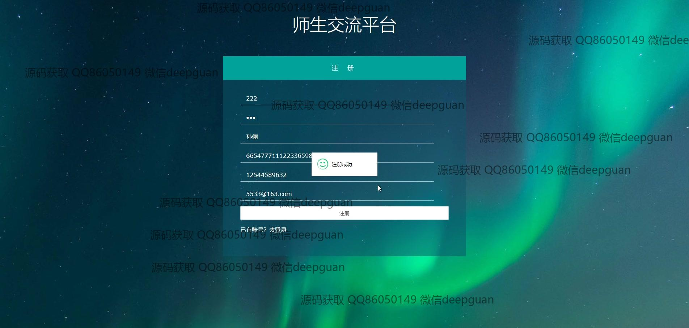
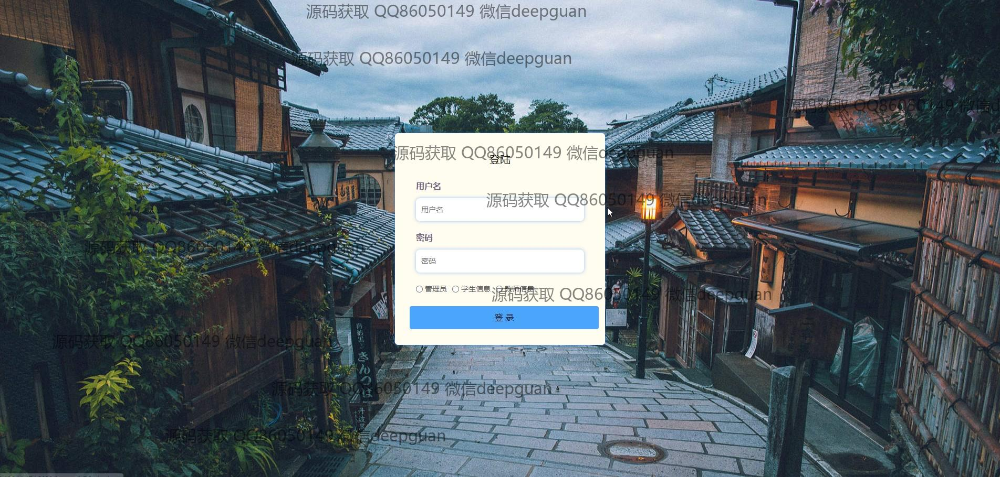

<h1 align="center">的师生交流答疑作业系统</h1>

## 简介
师生交流答疑作业系统：角色分为管理员、学生、教师；功能包括用户注册、登录、教学资源管理、作业管理、反馈与答疑、论坛发布等，提高师生互动和教学效率。    --计算机毕业设计源码；毕设源码；java毕业设计源码

## 联系方式

<h3 align="center">获取完整代码与数据库文件 + 微信：deepguan QQ: 86050149 QQ群: 783742310</h3>

<h3 align="center">可帮忙远程部署 包运行成功！提供远程部署、修改代码、设计文档指导、代码讲解等服务！</h3>

## 功能介绍（完整见运行截图）
管理员：基本功能包括登录和身份管理，为教师和学生创建或修改账户。系统维护涉及教学资源的管理、答疑和反馈数据的审核及发布、作业管理的流程监督。支持通过搜索栏查询教学和答疑信息，此外可进行管理员权限的设置和其它系统模块维护。

教师：可以注册并登录系统，管理个人信息和发布教学资源。教师可通过上传功能分享资料，并在作业管理模块内发布和查看作业。教师能反馈管理模块中处理学生的反馈信息，通过答疑功能回答学生的问题。教师中心还允许查看和编辑个人发布与收藏项目。

学生：具备注册和登录功能，可浏览和下载教师发布的教学资源。可以在系统内提交作业，通过作业管理模块查看作业进度及成绩。反馈管理模块允许学生提交意见或问题以获得教师回复。个人中心使学生能够管理个人信息、查看历史记录与进行账号设置。

用户：无论身份如何（管理员、教师或学生），每位用户可以在个人中心查看并编辑个人信息，管理个人收藏。系统提供通过主页导航访问各模块的功能，支持发布和查询操作，并附有上传功能用于文件和作业的处理。操作简便，旨在增强师生交互效率。

## 运行截图

本代码来源于网络,仅供学习参考使用!

